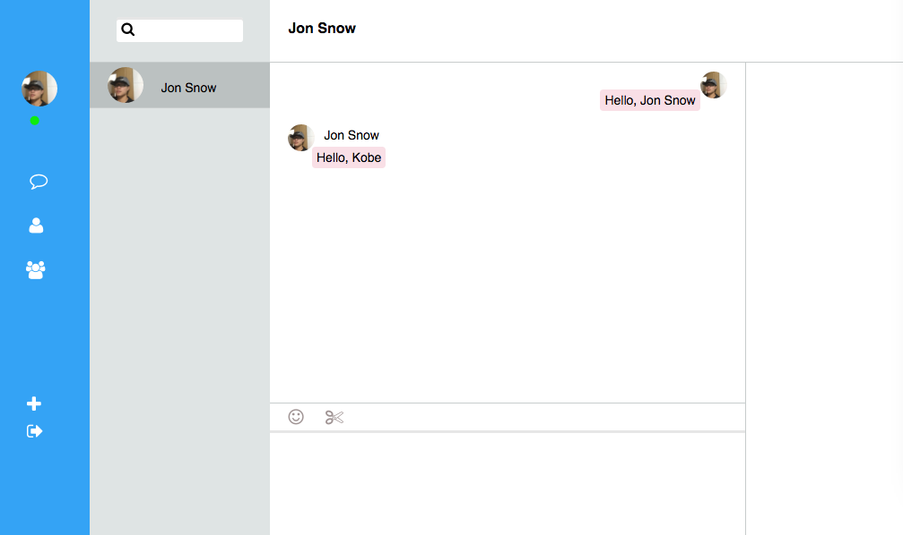

## wmlqq
Short for web-mac-like-qq, which is a side project base on ActionCable. 



## Requirements
	* Ruby 2.2.3
	* Rails > 5.0.0

## Setup

```ruby
	git clone git@github.com:vaucn/wmlqq.git
	cd wmlqq

	bundle
	rails db:migrate
	rails db:seed

	visit: http://localhost:3000/
	LOGIN:
		name: Kobe
		password: password

```